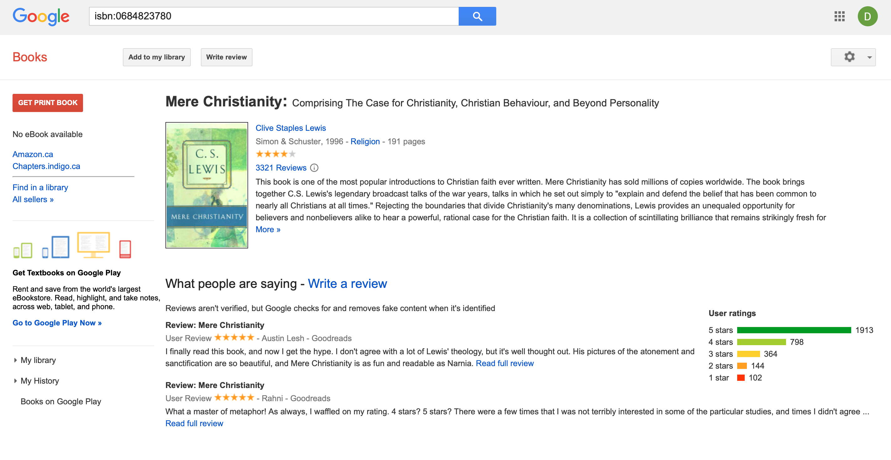

# Random-Book-for-Bookclub

## Intro

You with your friends decided to form a Book Club, but cant decide on the book.. Why not try finding a completely random book? Although still wanting a high rating and the book to be in english ;) Try using this code!

## Overview

Get a random book from Goodreads-books(https://www.kaggle.com/datasets/jealousleopard/goodreadsbooks), the dataset that includes integer ratings and is irrespective of language and publication. And then by using Google Books API get redirected onto the google page, where you either can read the description about the book or read the book itself(if one is available).

## Goals

* Discover new books
* Finding a book with high rating
* Rederection to Google Books Page to read reviews or read the book itself if thats an option

## Technologies

* Python
* Pandas
* Google Books API

## Conclusion

Here is the result! A random book was selected! And you were automatically redirected to the Google Books page, where you can find the description of this book, reviews and a link to see places where this book can be purchased.
#### Randomly Selected Book Shown in Terminal

#### Google Books Page

